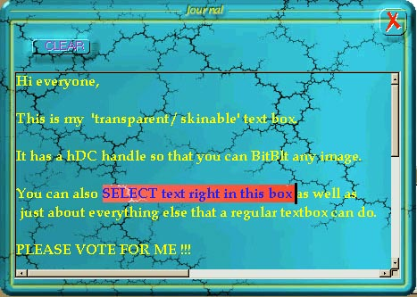



## Transparent Skin Textbox AND Buttons

### Description

This is the source code for a textbox that has an hDC handle! ***THIS IS NOT A LABEL*** This means that you can paint a picture / skin onto it, thus simulating transparency . . .or whatever you want it to look like. My textbox supports ALMOST EVERY function that a MS-textbox supports . .including selection of text, jumping to words and scrolling. ***PLEASE TAKE A LOOK*** Included in this code-download is also my newest 'low-memory' version of transparent buttons, which is a class-module that automates on-the-fly skinning of command buttons. A MUST SEE!
 
### More Info
 

             |
---                |---
**Submitted On**   |2000-10-23 15:17:40
**By**             |[Dave Andrews](https://github.com/Planet-Source-Code/PSCIndex/blob/master/ByAuthor/dave-andrews.md)
**Level**          |Advanced
**User Rating**    |4.2 (55 globes from 13 users)
**Compatibility**  |VB 5\.0, VB 6\.0
**Category**       |[Graphics](https://github.com/Planet-Source-Code/PSCIndex/blob/master/ByCategory/graphics__1-46.md)
**World**          |[Visual Basic](https://github.com/Planet-Source-Code/PSCIndex/blob/master/ByWorld/visual-basic.md)
**Archive File**   |[CODE\_UPLOAD1089810232000\.zip](https://github.com/Planet-Source-Code/dave-andrews-transparent-skin-textbox-and-buttons__1-12245/archive/master.zip)

